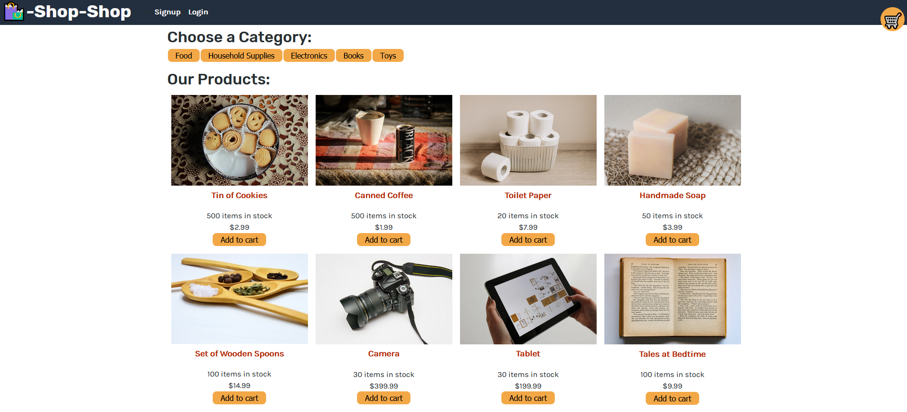

# E-Commerce Redux

## Description

This e-commerce app utilises React, Stripe, and Apollo/GraphQL to allow users to browse products, add them to their basket, and proceed to checkout with a secured payment method.

Deployed application link: [E-Commerce](https://lw-ecommerce-redux.herokuapp.com)

## Table of Contents

- [E-Commerce Redux](#e-commerce-redux)
  - [Description](#description)
  - [Table of Contents](#table-of-contents)
  - [Installation](#installation)
  - [Usage](#usage)
  - [Screenshots](#screenshots)
  - [Tech/framework used](#techframework-used)
  - [Scripts](#scripts)
  - [Contact](#contact)

## Installation

```
npm install
```

## Usage

To use the e-commerce site, simply head over to the deployed application link and browse some of the available products. To add them to your cart or purchase them, hit the sign up or login button.

## Screenshots

E-Commerce Homepage:


## Tech/framework used

<b>Built with</b>

- [Node.js](https://nodejs.org/en/)
- [React](https://reactjs.org//)
- [MongoDB](https://www.mongodb.com/)
- [Mongoose](https://www.npmjs.com/package/mongoose)
- [Apollo/GraphQL](https://www.apollographql.com)
- [Stripe](https://stripe.com/gb)

## Scripts

You can use the below scripts to run the app:

```
npm run start

npm run develop

```

## Contact

For any issues, please contact [my email](mailto:leonwheeler08@gmail.com) 😀
